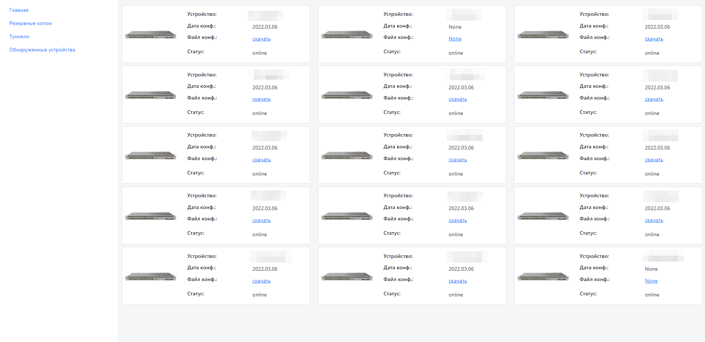

# RouterOSBackuper
Router OS Backuper with web interface

Need:

    Create in root dir this project:
     - .env:
            DB_PATH=files/app.db
            DB_TYPE=sqlite
            MT_USER=
            MT_PASSWORD=
            TELEGRAM_TOKEN=
            TELEGRAM_CHAT_ID=

    1. Install python requirements: requirements.txt:
     - python -m venv venv
     - venv/Scripts/activate
     - pip install -r requirements.txt

    2. Node.js 16.14 LTS:
     - npm init
     - npm i express

    3. Run:
        # Start WEB
        - node .\index.js

        # start API
        - python .\app.py

        # Start backup and discovery services
        - python .\run_services.py

